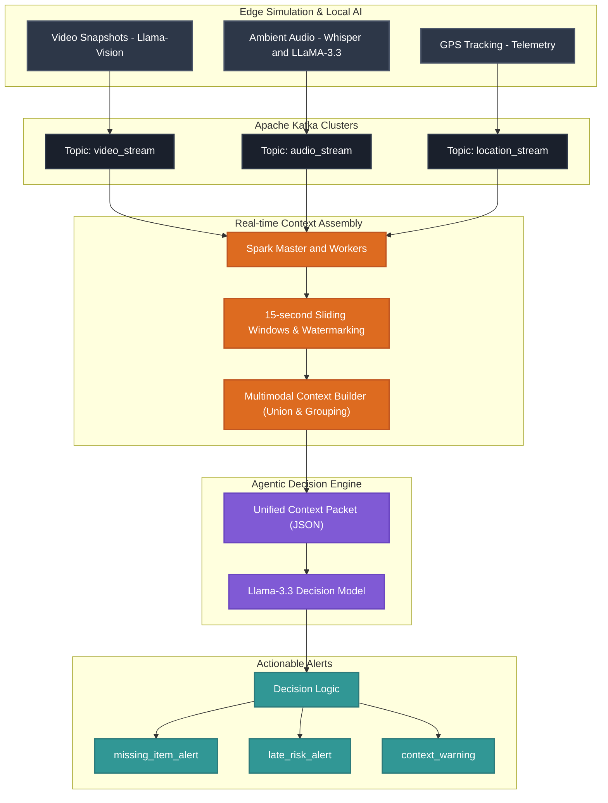

# 🧠 SmartPin: Real-Time Multimodal AI Assistant Pipeline

[](https://kafka.apache.org/)
[](https://spark.apache.org/)
[](https://groq.com/)
[](https://www.python.org/)
[](https://www.docker.com/)

An **end-to-end, event-driven streaming pipeline and agentic decision system** designed for next-generation wearable devices (like Smart Pins). 

This project simulates real-time multimodal telemetry—combining **visual snapshots, ambient audio transcripts, and GPS tracking**—ingests them via **Apache Kafka**, aligns and aggregates them using **Apache Spark Structured Streaming** over sliding time-windows, and routes them to a **Llama-3.3-powered Intelligent Decision Engine** for real-time contextual feedback.

---

## 🚀 Key Architectural Highlights

*   **Multimodal Streaming Producers:** Simulated IoT sensors for video, audio, and GPS telemetry streaming data at high frequencies to Kafka.
*   **Edge-AI Context Summarization:** Video snapshots are processed using state-of-the-art Visual Language Models (**LLaMA Vision**) to output structural visual signals. Audio streams are transcribed via **Whisper-large-v3** and summarized using **LLaMA-3.3** to build instantaneous semantic context.
*   **Temporal Stream Alignment (Spark):** A PySpark Structured Streaming application joins 3 separate, asynchronous Kafka topics (`video_stream`, `audio_stream`, `location_stream`) using a **15-second sliding window (`bucket_ts`)** with watermark delays to construct unified context packets.
*   **Intelligent Agentic Decision Engine:** A real-time engine leveraging `Llama-3.3-70B` via Groq that validates, interprets, and decides on actions (e.g., `ignore`, `notify`, `notify_urgent`) based on aggregated multimodal context.
*   **Microservices Containerization:** Fully dockerized Big Data infrastructure including Kafka, Spark Master/Workers, and Kafka UI for local cluster orchestration.

---

## 🗺️ System Architecture




---

## 📂 Repository Structure

```directory
smart-pin/
├── Producers/                     # Real-time Edge Producers
│   ├── audio_data/                # Raw Audio files directory (e.g. crying.mp3)
│   ├── video_data/                # Snapshots / images directory (e.g. danger.jpg)
│   ├── audio_stream.py            # Whisper transcription & context framing to Kafka
│   ├── video_stream.py            # VLM visual analysis to Kafka
│   ├── location_stream.py         # Simulated GPS telemetry streaming
│   └── run_producers.py           # Multi-process orchestrator for all streams
├── Consumer/                      # Big Data Stream Aggregator
│   └── context_builder.py         # PySpark Structured Streaming Consumer
├── Decision_engine/               # AI Orchestration & Logic
│   └── utils.py                   # Llama-3.3 real-time decision & schema validator
├── notebooks/                     # R&D Jupyter Notebooks
│   ├── audio.ipynb                # Whisper audio processing tests
│   └── vlm.ipynb                  # Visual Language Model experiments
├── docker-compose.yml             # Spark Master, Spark Worker, Kafka, & Kafka UI
├── requirements.txt               # Main Python dependencies
└── MVP_use_cases.txt              # Primary targeted functional scenarios
```

---

## 🎯 Target Functional Use Cases

The pipeline is tested against diverse, dynamic situational scenarios to enable proactive user assistance:

1.  **Time Optimization (`Optimisation du temps`):** 
    By analyzing visual surroundings (e.g., train station signs, heavy traffic) and current GPS location in relation to calendar deadlines, the engine flags potential tardiness and suggests alternatives (`late_risk_alert`).
2.  **Hydration & Activity Tracker (`Hydratation / Activité`):**
    Aggregates passive voice cues (e.g., "I feel so dehydrated") and visual environments (e.g., gym weights or a sedentary desk setup) to prompt timely reminders.
3.  **Contextual Question Answering (`Question contextuelle`):**
    Handles direct, active voice queries referencing the surrounding environment (e.g., "What is this tool on the table?"). The visual VLM feeds objects into the decision model to structure immediate responses.
4.  **Smart Meeting Assistant (`Assistant de réunion`):**
    Detects office spaces, whiteboards, or open laptops, while transcribing notes on "introductions, key deadlines, brainstorms," to summarize action items and flag urgent actionables.

---

## 🛠️ Step-by-Step Installation & Setup

### Prerequisites
Make sure you have **Docker**, **Docker Compose**, and **Python 3.10+** installed on your system.

### 1. Environment Configuration
Create a `.env` file in the root directory:
```env
GROQ_API_KEY=your_groq_api_key_here
KAFKA_BOOTSTRAP_SERVERS=kafka:9092
CONTEXT_USER_ID=user_001
```

### 2. Launch Big Data Infrastructure
Use Docker Compose to run Spark, Kafka, and Kafka UI in the background:
```bash
docker compose up -d
```
> 📊 **Kafka UI Dashboard:** Accessible at [http://localhost:8090](http://localhost:8090) to monitor stream throughput and topic activities!
> ⚙️ **Spark Web UI:** Monitor executors and streaming queries at [http://localhost:8080](http://localhost:8080).

### 3. Install Python Dependencies
```bash
pip install -r requirements.txt
```

### 4. Run Telemetry Streams
Start the multi-processed edge producers which will automatically look for audio/video media in `Producers/audio_data/` and `Producers/video_data/` and publish to Kafka:
```bash
python Producers/run_producers.py
```

### 5. Start PySpark Structured Streaming Aggregator
Execute the context builder inside the Spark container to perform temporal joining and windowing on the stream:
```bash
docker exec -it spark-master /opt/spark/bin/spark-submit \
  --master spark://spark-master:7077 \
  --conf spark.jars.ivy=/tmp/.ivy \
  --packages org.apache.spark:spark-sql-kafka-0-10_2.12:3.5.1 \
  /opt/spark-apps/Consumer/context_builder.py
```

### 6. Run the AI Decision Engine
To run a decision test over unified context frames:
```bash
python Decision_engine/utils.py
```

---

## 💡 Technological Insights (For Recruiters)

This codebase illustrates a production-ready approach to developing modern, scalable AI and Big Data architectures:

*   **Stateful Event-Time Processing:** Demonstrates knowledge of **watermarking** and **event-time windowing** in PySpark to handle delayed, out-of-order records in distributed architectures.
*   **Structured Outputs & LLM Guardrails:** Utilizes strict JSON-schemas, Groq's high-speed inference, and manual Pydantic-like validations inside the `Decision_engine` to enforce model predictability and prevent hallucinations.
*   **Microservices Orchestration:** Integrates containerized JVM components (Kafka, Spark) with local Python environments, preparing it for cloud-scale Kubernetes/AWS deployment.
*   **Modular Architecture:** Strict separation between Edge simulation (Producers), Core Aggregation (Consumer/Spark), and Intelligence Layers (LLMs/VLMs).

---

*Developed with 💡 and 🧠 as a portfolio project for AI Engineering & Big Data Software internships.*
